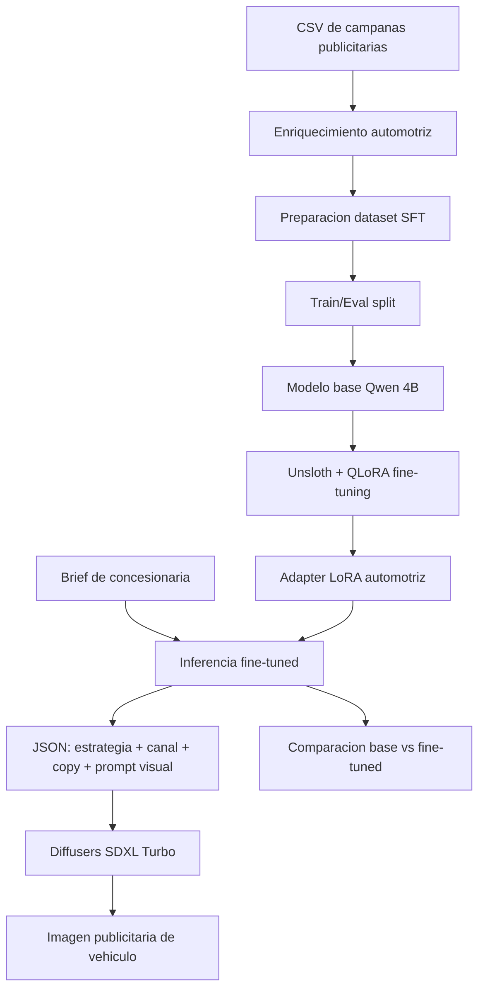

# Plan Demo Notebook: Dealership GenAI Campaign Studio

## Summary

Crear una demo autocontenida en un notebook para Kaggle o Google Colab que cumpla las indicaciones del proyecto final: fine-tuning de un LLM con Unsloth + LoRA, generacion de imagenes con Diffusers, comparacion base vs fine-tuned y documentacion tecnica orientada a valor comercial.

El proyecto sera una prueba funcional, no una app completa. La experiencia principal sera ejecutar el notebook de arriba hacia abajo y terminar con:

- dataset comercial de campanas publicitarias para una concesionaria, preparado con minimo 200 ejemplos
- modelo fine-tuned con LoRA
- comparacion base vs fine-tuned
- generacion de estrategia publicitaria, copy, recomendacion de canal y prompt visual
- imagen publicitaria de vehiculo generada con Diffusers
- metricas y ejemplos para la presentacion final

## Demo Concept

- Nombre sugerido: `Dealership GenAI Campaign Studio`.
- Industria: concesionarias de vehiculos, marketing automotriz y equipos comerciales.
- Problema: una concesionaria necesita crear campanas diferenciadas para autos, SUVs, pickups, vans, vehiculos electricos o seminuevos, adaptando mensaje, canal y visual al target correcto.
- Solucion demo: un notebook que aprende patrones de campanas publicitarias automotrices y genera recomendaciones multimodales para nuevos briefs comerciales.
- Usuario final: ejecutivo comercial de concesionaria, jefe de marketing automotriz, asesor de ventas o agencia que atiende dealers.
- Alcance de campanas: publicidad para distintos canales, targets, sectores de clientes, ubicaciones y tipos de vehiculo.

## Notebook Scope

El entregable principal sera un notebook:

```text
notebooks/proyecto_final_commercial_demo_colab_kaggle.ipynb
```

El notebook debe incluir secciones claramente ejecutables:

1. Setup del entorno.
2. Carga del dataset comercial.
3. Preparacion de ejemplos SFT.
4. Carga del modelo base con Unsloth.
5. Configuracion LoRA/QLoRA.
6. Entrenamiento.
7. Inferencia con modelo base.
8. Inferencia con modelo fine-tuned.
9. Comparacion cuantitativa y cualitativa.
10. Generacion de imagenes con Diffusers.
11. Demo final end-to-end.
12. Conclusiones tecnicas y de negocio.

## Technical Requirements Coverage

- Python como lenguaje principal.
- Hugging Face Transformers para carga/inferencia de modelo.
- Unsloth obligatorio para fine-tuning eficiente.
- LoRA o QLoRA para entrenar en recursos limitados.
- Modelo LLM de 4B a 13B parametros.
- Dataset minimo de 200 ejemplos comerciales.
- Diffusers obligatorio para generar imagenes.
- Comparacion base vs fine-tuned con metricas y ejemplos.
- Notebook reproducible en Kaggle o Colab.
- README breve con instrucciones de ejecucion.
- Diagrama de arquitectura en Markdown/Mermaid.
- Estimacion de valor de negocio o ROI para la presentacion.

## Dataset Plan

Usar un dataset tabular de campanas publicitarias automotrices. Si no existe un dataset real de concesionaria, construir uno sintetico y reproducible a partir de `Social_Media_Advertising.csv`, enriqueciendo cada fila con variables del dominio vehicular.

Campos relevantes:

- `Campaign_Goal`
- `Target_Audience`
- `Channel_Used`
- `Customer_Segment`
- `Location`
- `Language`
- `Duration`
- `Conversion_Rate`
- `Acquisition_Cost`
- `ROI`
- `Clicks`
- `Impressions`
- `Engagement_Score`
- `Company`

Campos automotrices a agregar:

- `Vehicle_Type`: sedan, SUV, pickup, hatchback, van, electric, hybrid, luxury, used
- `Vehicle_Model`: nombre comercial sintetico o realista
- `Price_Range`: economy, mid-range, premium, luxury
- `Customer_Sector`: familias, jovenes profesionales, emprendedores, empresas/flotas, conductores urbanos, clientes rurales, compradores eco-conscious
- `Purchase_Intent`: primer auto, renovacion, trabajo, familia, aventura, flota, ahorro combustible
- `Promotion_Type`: test drive, bono de descuento, financiamiento, mantenimiento incluido, entrega inmediata, retoma
- `Sales_Funnel_Stage`: awareness, consideration, lead generation, conversion, retention

Preparacion:

- limpiar costo de adquisicion removiendo `$` y convirtiendo a numero
- normalizar textos vacios
- tomar una muestra deterministica de 300 filas
- enriquecer cada fila con variables automotrices usando reglas deterministicas
- split:
  - 240 train
  - 60 eval
- convertir cada fila a formato instructivo para campanas de concesionaria

Formato de ejemplo:

```json
{
  "instruction": "Actua como estratega publicitario para una concesionaria de vehiculos. Genera una propuesta de campana en JSON.",
  "input": "Objetivo: Lead Generation | Vehiculo: SUV hibrida | Rango: mid-range | Audiencia: Families 35-44 | Sector cliente: familias urbanas | Canal historico: Instagram | Ciudad: Miami | Idioma: Spanish | Duracion: 30 Days | Promocion: test drive + financiamiento | ROI: 2.10 | Conversion rate: 0.08 | Engagement: 9",
  "output": {
    "strategy": "Promover seguridad, espacio familiar y ahorro de combustible, cerrando con una invitacion a test drive.",
    "channel_plan": "Usar Instagram para awareness visual y formularios de lead generation; reforzar con remarketing en Meta Ads.",
    "ad_copy": "Tu familia merece mas espacio, tecnologia y eficiencia. Agenda hoy tu test drive y conoce la SUV hibrida que se adapta a tu ciudad.",
    "image_prompt": "Spanish Instagram ad for a mid-range hybrid SUV dealership campaign targeting urban families in Miami, modern family entering a clean SUV, bright city background, premium automotive commercial photography, clear space for headline",
    "kpis": ["Leads", "Cost per Lead", "Test Drive Bookings", "Conversion Rate", "ROI"],
    "business_note": "Priorizar leads calificados y medir reservas de test drive antes de escalar presupuesto."
  }
}
```

## Model And Training Plan

Modelo recomendado:

- `unsloth/Qwen3-4B-Instruct-2507-unsloth-bnb-4bit`

Fallback si hay problemas de memoria o compatibilidad:

- `unsloth/Qwen2.5-3B-Instruct` solo para pruebas tecnicas, dejando documentado que el objetivo evaluable es usar 4B-13B.

Configuracion inicial:

- `max_seq_length = 2048`
- `load_in_4bit = True`
- `r = 16`
- `lora_alpha = 16`
- `lora_dropout = 0`
- `bias = "none"`
- `use_gradient_checkpointing = "unsloth"`
- `learning_rate = 2e-4`
- `per_device_train_batch_size = 2`
- `gradient_accumulation_steps = 4`
- `num_train_epochs = 2` para demo rapida
- `num_train_epochs = 3` para resultado final si el tiempo lo permite
- `optim = "adamw_8bit"`
- `seed = 3407`

Outputs:

```text
outputs/commercial-qwen-lora/
outputs/evaluation/
outputs/generated_images/
```

## Diffusers Image Plan

Generar imagenes usando el campo `image_prompt` producido por el modelo. Las imagenes deben representar conceptos publicitarios automotrices, no mockups genericos.

Modelo recomendado para demo:

- `stabilityai/sdxl-turbo`

Configuracion inicial:

- `num_inference_steps = 4`
- `guidance_scale = 0.0` para SDXL Turbo
- `width = 512`
- `height = 512`
- seed fija para reproducibilidad

Negative prompt sugerido:

```text
blurry, low quality, watermark, distorted text, malformed logo, extra fingers, bad anatomy, jpeg artifacts
```

Salida esperada:

- 3 imagenes PNG generadas para 3 briefs de concesionaria.
- galeria comparativa dentro del notebook.
- tabla con prompt, seed, modelo y observacion cualitativa.

Briefs visuales recomendados:

- SUV familiar para familias urbanas en Instagram.
- Pickup para emprendedores o clientes rurales en Facebook/YouTube.
- Vehiculo electrico para profesionales jovenes eco-conscious en TikTok/Instagram.

## Evaluation Plan

Comparacion base vs fine-tuned:

- usar 5 briefs del set de evaluacion
- generar respuesta con modelo base
- generar respuesta con modelo fine-tuned
- mostrar tabla con ambos resultados

Metricas cuantitativas simples:

- training loss final
- eval loss si el trainer la produce
- porcentaje de respuestas con JSON valido
- cobertura de campos obligatorios:
  - `strategy`
  - `channel_plan`
  - `ad_copy`
  - `image_prompt`
  - `kpis`
  - `business_note`
- similitud Jaccard entre salida generada y salida esperada
- latencia promedio de inferencia

Evaluacion cualitativa:

- tono comercial
- claridad de recomendacion
- uso de metricas historicas
- calidad del copy
- utilidad del prompt visual
- alineacion de la imagen con el brief

## End-To-End Demo Flow

El notebook debe cerrar con una celda de demo que reciba un brief nuevo:

```python
demo_brief = {
    "campaign_goal": "Lead Generation",
    "vehicle_type": "SUV hibrida",
    "vehicle_model": "Nova Hybrid X",
    "price_range": "mid-range",
    "target_audience": "Families 35-44",
    "customer_sector": "familias urbanas",
    "location": "Miami",
    "language": "Spanish",
    "duration": "30 Days",
    "preferred_channels": ["Instagram", "Facebook"],
    "promotion_type": "test drive + financiamiento",
    "budget_hint": "$1,500"
}
```

La demo debe producir:

1. propuesta comercial en JSON
2. copy publicitario
3. recomendacion de canal segun target y etapa del funnel
4. KPIs recomendados
5. prompt visual
6. imagen generada
7. breve interpretacion de valor de negocio para la concesionaria

## Minimal File Set

Para mantenerlo como demo notebook, el proyecto solo necesita:

```text
notebooks/proyecto_final_commercial_demo_colab_kaggle.ipynb
data/Social_Media_Advertising.csv
README_demo.md
docs/demo_architecture.md
```

Archivos opcionales si se quiere ordenar mejor:

```text
outputs/commercial-qwen-lora/
outputs/generated_images/
outputs/evaluation_report.json
```

## README Demo Content

`README_demo.md` debe explicar:

- objetivo del proyecto
- requerimientos de GPU
- como correr en Colab
- como correr en Kaggle
- donde subir/cargar el CSV
- como entrenar el LoRA
- como generar imagenes
- que outputs se esperan
- limitaciones conocidas

## Architecture Diagram

Incluir en `docs/demo_architecture.md` o dentro del notebook:



## Business Value / ROI Narrative

Hipotesis de impacto para la presentacion:

- reducir preparacion de campanas publicitarias para vehiculos de 2-3 horas a 10-15 minutos
- producir variantes por tipo de vehiculo, canal y target sin esperar un primer ciclo de diseno
- mejorar consistencia entre oferta comercial, copy, target e imagen
- acelerar pruebas A/B por canal: Meta, TikTok, YouTube, Google Display o email
- usar datos historicos y atributos del vehiculo para que la recomendacion no sea puramente generica

Formula simple de ROI:

```text
ROI estimado = (horas ahorradas por propuesta * costo hora comercial * propuestas mensuales - costo operativo IA) / costo operativo IA
```

Ejemplo para presentacion:

```text
Si se ahorran 2 horas por propuesta, con 40 propuestas al mes y un costo de USD 25/hora:
ahorro mensual = 2 * 40 * 25 = USD 2,000
si el costo operativo mensual de IA es USD 200:
ROI = (2,000 - 200) / 200 = 9x
```

## Acceptance Criteria

- El notebook puede ejecutarse secuencialmente en Kaggle o Colab con GPU.
- El dataset procesado contiene minimo 200 ejemplos.
- El entrenamiento usa Unsloth + LoRA/QLoRA.
- El modelo base esta en el rango 4B-13B.
- Se guardan adaptadores LoRA.
- Hay comparacion base vs fine-tuned.
- Se generan metricas cuantitativas basicas.
- Se genera al menos una imagen con Diffusers.
- Hay diagrama de arquitectura.
- Hay narrativa clara de impacto comercial/ROI.

## Assumptions

- El alcance es una demo academica reproducible, no una app productiva.
- Kaggle/Colab tendran GPU disponible para entrenamiento.
- La generacion de imagenes usara inferencia con Diffusers, no entrenamiento visual.
- El dataset comercial tabular sera convertido a ejemplos instructivos sinteticos de publicidad automotriz.
- Las marcas/modelos de vehiculos pueden ser sinteticos para evitar dependencia de datos privados de una concesionaria real.
- La presentacion se construira despues usando los resultados y screenshots del notebook.
