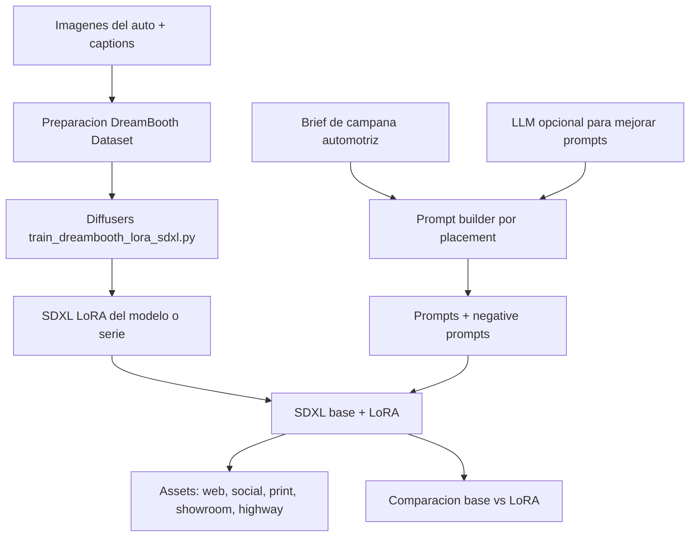

# Arquitectura Demo: Automotive Marketing Content LoRA Studio

## Flujo funcional



## Componentes

- **Dataset visual**: imagenes del auto y captions en `data/car_campaign_lora/images/`.
- **Preparacion DreamBooth**: copia normalizada de imagenes y captions para entrenamiento.
- **Modelo base**: SDXL base cargado desde Hugging Face Diffusers.
- **Fine-tuning visual**: DreamBooth LoRA con `train_dreambooth_lora_sdxl.py`.
- **Prompt builder**: plantillas por placement de marketing automotriz.
- **LLM opcional**: mejora prompts, sin fine-tuning.
- **Generacion visual**: SDXL + LoRA produce assets por canal.
- **Evaluacion**: comparacion base vs LoRA, metadata de seeds, dimensiones y latencia.

## Valor comercial esperado

El pipeline permite producir primeros conceptos visuales para una campana automotriz en minutos, probar multiples placements antes de diseno final y mantener consistencia visual del modelo de auto.

```text
ROI estimado = (horas creativas ahorradas * costo hora equipo creativo * campanas mensuales - costo operativo IA) / costo operativo IA
```

Ejemplo: 12 horas ahorradas * 6 campanas/mes * USD 35/hora = USD 2,520 de ahorro mensual. Si operar IA cuesta USD 300/mes, ROI estimado = 7.4x.
