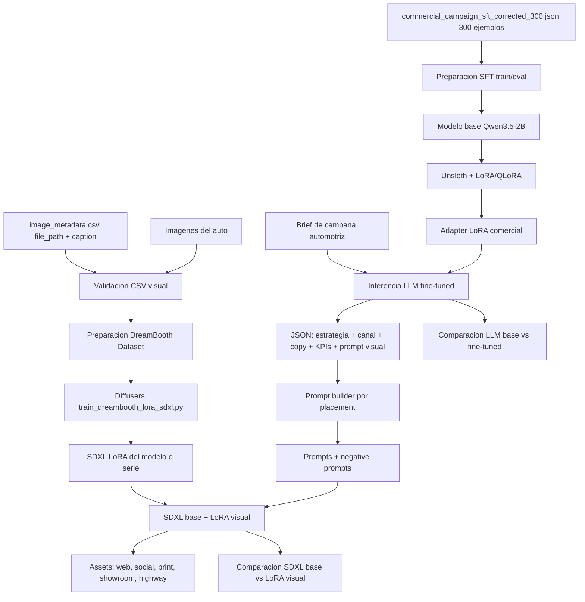

# Arquitectura Demo: Automotive Marketing Content LoRA Studio

## Flujo funcional



## Componentes

- **Dataset LLM SFT**: JSON corregido con 300 ejemplos en `data/commercial_campaing_sft/commercial_campaign_sft_corrected_300.json`, usando `instruction`, `input` y `output`.
- **Preparacion SFT**: validacion de esquema, split train/eval y formateo instruct/chat para Unsloth.
- **Modelo LLM base**: Qwen3.5-2B cargado con Unsloth.
- **Fine-tuning LLM**: LoRA/QLoRA para aprender propuestas comerciales automotrices.
- **Adapter comercial**: salida en `outputs/commercial-qwen-lora/`.
- **Dataset visual**: `image_metadata.csv` en `data/car_campaign_lora/` con columnas `file_path` y `caption`, mas imagenes en `data/car_campaign_lora/images/`.
- **Preparacion DreamBooth**: validacion del CSV, rutas de imagenes y captions con trigger word visual.
- **Modelo visual base**: SDXL base cargado desde Hugging Face Diffusers.
- **Fine-tuning visual**: DreamBooth LoRA con `train_dreambooth_lora_sdxl.py`.
- **Adapter visual**: salida en `outputs/automotive-lora/`.
- **Prompt builder**: convierte la salida JSON del LLM fine-tuned en prompts por placement de marketing automotriz.
- **Generacion visual**: SDXL + LoRA visual produce assets por canal.
- **Evaluacion LLM**: comparacion Qwen base vs Qwen fine-tuned, JSON validity, cobertura de campos y latencia.
- **Evaluacion visual**: comparacion SDXL base vs SDXL con LoRA visual, metadata de seeds, dimensiones, paths y latencia.

## Contratos de entrada

### LLM fine-tuning

```text
data/commercial_campaing_sft/commercial_campaign_sft_corrected_300.json
```

El archivo debe ser una lista JSON con 300 objetos:

```json
{
  "instruction": "Act as an advertising strategist for an automotive dealership. Generate a campaign proposal in JSON.",
  "input": "Goal: Lead Generation | Vehicle: hybrid SUV | Price range: mid-range | Audience: Families 35-44 | Customer sector: urban families | Historical channel: Instagram | City: Miami | Language: English | Duration: 30 Days | Promotion: test drive + financing | ROI: 2.10 | Conversion rate: 0.08 | Engagement: 9",
  "output": {
    "strategy": "Promote safety, family space, and fuel efficiency, closing with a clear invitation to book a test drive.",
    "recommended_channel": "Instagram",
    "channel_rationale": "Instagram matches a visual family audience and supports lead forms for test drive intent.",
    "channel_plan": "Use Instagram for visual awareness and lead generation forms; reinforce with Meta Ads remarketing for interested prospects.",
    "ad_copy": "Give your family more space, technology, and efficiency. Book your test drive today and discover the hybrid SUV built for city life.",
    "image_prompt": "REALCARMODEL real car model in an English Instagram ad for a mid-range hybrid SUV dealership campaign targeting urban families in Miami, bright city background, premium automotive commercial photography, clear space for headline, no readable text",
    "kpis": ["Leads", "Cost per Lead", "Test Drive Bookings", "Conversion Rate", "ROI"],
    "business_note": "Prioritize qualified leads and measure test drive bookings before scaling the media budget."
  }
}
```

El `negative_prompt` no forma parte obligatoria del dataset SFT del LLM. El prompt builder lo agrega como configuracion deterministica para Diffusers, con fallback fijo para evitar agua, texto deformado, ruedas extra y artefactos.

### Diffusion fine-tuning

```text
data/car_campaign_lora/image_metadata.csv
data/car_campaign_lora/images/
```

El CSV debe tener una fila por imagen:

```csv
file_path,caption
./images/real_car_model_01.png,"REALCARMODEL real car model, front three quarter view, metallic blue paint, studio automotive photography, premium lighting"
```

## Valor comercial esperado

El pipeline permite producir propuestas comerciales y primeros conceptos visuales para una campana automotriz en minutos, probar multiples placements antes de diseno final y mantener consistencia entre oferta, target, canal, copy e identidad visual del modelo de auto.

```text
ROI estimado = ((horas creativas ahorradas * costo hora equipo creativo * campanas mensuales) + (horas comerciales ahorradas * costo hora comercial * propuestas mensuales) - costo operativo IA) / costo operativo IA
```

Ejemplo: 12 horas creativas ahorradas * 6 campanas/mes * USD 35/hora = USD 2,520. Si ademas se ahorran 2 horas comerciales * 40 propuestas/mes * USD 25/hora = USD 2,000, y operar IA cuesta USD 300/mes, ROI estimado = 14.07x.
