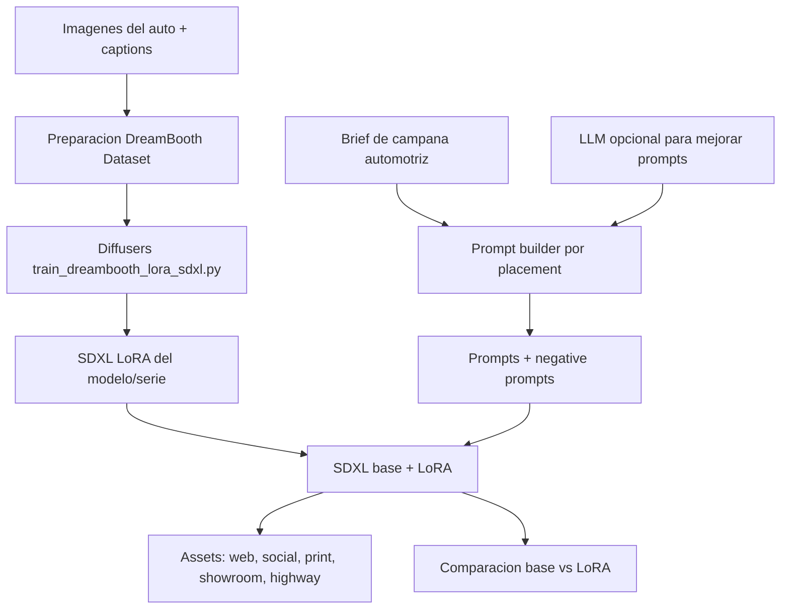

# Plan Demo Notebook: Automotive Marketing Content LoRA Studio

## Summary

Crear una demo autocontenida en un notebook para Kaggle o Google Colab siguiendo la estructura del notebook de referencia `LoRA_Logo_Marca_Colab.ipynb`, pero aplicada a generacion de contenido visual para campanas automotrices.

El alcance se reduce y se vuelve mas claro:

- el fine-tuning se realiza sobre un modelo de difusion con DreamBooth LoRA
- el dataset principal es una serie de imagenes del auto + descripciones/captions
- el objetivo es generar piezas visuales de marketing para distintos canales y placements
- el LLM no se fine-tunea; solo puede usarse opcionalmente para mejorar prompts y negative prompts
- la comparacion principal es modelo base vs modelo con LoRA visual

El proyecto sera una prueba funcional, no una app completa. La experiencia principal sera ejecutar el notebook de arriba hacia abajo y terminar con:

- dataset visual preparado con imagenes y captions
- LoRA visual entrenado sobre SDXL/Diffusers
- comparacion base vs LoRA entrenado
- prompts comerciales para diferentes placements
- banners y piezas visuales generadas para una campana automotriz
- metricas simples y ejemplos para la presentacion final

## Demo Concept

- Nombre sugerido: `Automotive Marketing Content LoRA Studio`.
- Industria: marketing automotriz, agencias creativas y equipos comerciales de concesionarios.
- Problema: producir piezas visuales consistentes para lanzamientos de autos requiere sesiones de diseno, adaptaciones por canal y revision de identidad visual.
- Solucion demo: un notebook que aprende el look de un auto/modelo desde imagenes con captions y genera visuales publicitarios para distintos contextos.
- Usuario final: equipo de marketing automotriz, agencia creativa, planner de medios o concesionario.
- Ejemplo de campana: lanzamiento de un modelo real de auto. La marca/modelo exacto se definira cuando esten listas las imagenes y descripciones.

## Notebook Scope

El entregable principal sera un notebook:

```text
notebooks/proyecto_final_automotive_lora_marketing_colab_kaggle.ipynb
```

El notebook debe incluir secciones claramente ejecutables:

1. Verificar GPU.
2. Instalar librerias compatibles.
3. Configurar proyecto, marca/modelo y rutas.
4. Cargar imagenes + descriptions/captions.
5. Preparar dataset DreamBooth LoRA.
6. Descargar script oficial de entrenamiento Diffusers.
7. Configurar parametros de entrenamiento.
8. Entrenar LoRA visual.
9. Verificar adaptadores generados.
10. Cargar SDXL base con el LoRA entrenado.
11. Construir prompts de campana por placement.
12. Opcional: mejorar prompts y negative prompts con un LLM.
13. Generar piezas para web, social, showroom, print y highway banner.
14. Comparar modelo base vs modelo con LoRA.
15. Guardar galeria, metadata y conclusiones de negocio.

## Technical Requirements Coverage

- Python como lenguaje principal.
- Hugging Face Diffusers para entrenamiento e inferencia de imagenes.
- PEFT/LoRA para fine-tuning eficiente del modelo de difusion.
- DreamBooth LoRA para aprender un concepto visual especifico: el modelo/serie del auto.
- Dataset visual con imagenes + captions descriptivos.
- Comparacion base vs LoRA fine-tuned con ejemplos visuales.
- Notebook reproducible en Kaggle o Colab.
- README breve con instrucciones de ejecucion.
- Diagrama de arquitectura en Markdown/Mermaid.
- Estimacion de valor de negocio o ROI para la presentacion.
- LLM opcional solo para prompt engineering; no se entrena un LLM en esta version.

> Nota de alcance: esta version intentionally prioriza el fine-tuning visual con Diffusers porque el caso de uso final es generar contenido visual de marketing. Si el docente exige explicitamente fine-tuning de LLM con Unsloth, se debe documentar como extension futura o agregar un modulo separado.

## Visual Dataset Plan

Usar una carpeta de imagenes del auto o serie de autos y captions asociados.

Estructura recomendada:

```text
data/car_campaign_lora/
  images/
    real_car_model_01.png
    real_car_model_02.png
    ...
  metadata.csv
  metadata_template.csv
```

El metadata debe tener una fila por imagen:

```csv
file_path,caption
./images/real_car_model_01.png,"REALCARMODEL real car model, front three quarter view, metallic blue paint, studio automotive photography, premium lighting"
```

Decision de dataset:

- `metadata.csv` sera la fuente de verdad para captions.
- No se usaran archivos `.txt` sidecar por imagen en esta demo.
- La razon es que el CSV facilita auditoria, edicion en lote, validacion de rutas y versionamiento cuando trabajemos con modelos reales.
- Esta estructura tambien deja listo el dataset para futuros scripts caption-aware si se decide entrenar con captions por imagen.

Nota tecnica: el script `train_dreambooth_lora_sdxl.py` usado en esta demo recibe un `instance_prompt` comun. Por eso las captions del metadata se usan para QA del dataset, documentacion, trazabilidad y construccion de prompts; no reemplazan automaticamente el `instance_prompt` en el comando base.

Cada caption debe estar en ingles y contener:

- trigger word unico del concepto visual
- marca/modelo o serie del auto
- angulo o vista del vehiculo
- color/materiales
- contexto visual
- tipo de fotografia

Ejemplos de captions:

```text
REALCARMODEL real car model, front three quarter view, metallic blue paint, studio automotive photography, premium lighting
REALCARMODEL real car model, side profile, urban night background, cinematic reflections, commercial car advertisement
REALCARMODEL real car model interior dashboard, modern digital cockpit, luxury materials, clean product photography
```

Recomendaciones:

- minimo tecnico: 8-15 imagenes para prueba rapida
- recomendado para demo final: 20-40 imagenes
- resolucion minima: 512x512
- mejor si las imagenes cubren frontal, lateral, trasera, interior, detalle de ruedas y contexto lifestyle
- evitar logos de terceros, texto pequeno y fondos demasiado caoticos

## Model And Training Plan

Modelo recomendado para fine-tuning visual:

- `stabilityai/stable-diffusion-xl-base-1.0`

Script de entrenamiento:

- `train_dreambooth_lora_sdxl.py` desde Hugging Face Diffusers

Configuracion inicial estilo notebook de referencia:

- `resolution = 512`
- `train_batch_size = 1`
- `gradient_accumulation_steps = 4`
- `learning_rate = 1e-4`
- `lr_scheduler = "constant"`
- `max_train_steps = 250` para demo rapida en Colab/Kaggle free tier
- `max_train_steps = 400-800` para resultado final si la GPU y el tiempo lo permiten
- `rank = 16`
- `mixed_precision = "fp16"`
- `seed = 3407`
- `instance_prompt = "REALCARMODEL real car model automotive marketing campaign asset"`

Outputs:

```text
outputs/automotive-lora/
outputs/generated_assets/
outputs/evaluation/
```

## Prompt Engineering Plan

El prompt base se construye desde un brief de campana, por ejemplo:

```python
campaign_brief = {
    "brand": "Ford",
    "model_series": "TBD real model",
    "trigger_word": "REALCARMODEL",
    "launch_message": "new model launch campaign",
    "target_audience": "professionals 30-45",
    "market": "US and Latin America",
    "tone": "premium, confident, innovative",
}
```

Placements esperados:

- website hero banner, horizontal 16:9
- Instagram feed, square 1:1
- Instagram story or TikTok vertical, 9:16
- dealership showroom poster, vertical print
- highway billboard, ultra-wide
- email header, wide horizontal
- product detail image, clean studio

Prompt ejemplo:

```text
REALCARMODEL real car model in a premium website hero banner, new model launch campaign, professionals 30-45, cinematic automotive photography, clean reflections, modern city skyline, confident innovative tone, no readable text, high quality commercial advertising
```

Negative prompt sugerido:

```text
blurry, low quality, watermark, distorted text, malformed logo, extra wheels, deformed car, broken headlights, bad perspective, jpeg artifacts, people with distorted faces
```

## Optional LLM Prompt Refiner

El LLM es opcional y no se entrena. Su rol es mejorar prompts:

- transformar un brief comercial en prompts especificos por placement
- enriquecer estilo, composicion, iluminacion y angulo de camara
- generar negative prompts mas robustos
- mantener consistencia de trigger word y restricciones de marca

Implementacion sugerida:

- una celda `USE_LLM_PROMPT_REFINER = False` por defecto
- si se activa, cargar un modelo pequeno con Transformers o usar un proveedor externo
- fallback deterministico: usar plantillas Python de prompts

## Evaluation Plan

Comparacion base vs LoRA:

- usar 3-5 prompts identicos
- generar imagen con SDXL base sin LoRA
- cargar LoRA visual y generar la misma pieza con igual seed
- mostrar comparacion lado a lado

Metricas cuantitativas simples:

- training loss final si el script la reporta
- numero de imagenes de entrenamiento
- numero de captions validos
- numero de assets generados
- tiempo promedio de generacion por asset
- cobertura de placements requeridos

Evaluacion cualitativa:

- identidad visual del auto reconocible
- consistencia entre vistas del vehiculo
- calidad publicitaria
- alineacion con placement
- claridad de composicion
- ausencia de texto deformado, marcas de agua o anatomia vehicular extraña

## End-To-End Demo Flow

El notebook debe cerrar con una celda de demo que reciba un brief nuevo:

```python
campaign_brief = {
    "brand": "Ford",
    "model_series": "TBD real model",
    "trigger_word": "REALCARMODEL",
    "launch_message": "new model launch campaign",
    "target_audience": "professionals 30-45",
    "market": "US and Latin America",
    "tone": "premium, confident, innovative",
}
```

La demo debe producir:

1. prompts de campana por placement
2. negative prompt recomendado
3. imagenes generadas para al menos 5 placements
4. comparacion base vs LoRA entrenado
5. tabla con prompt, seed, modelo, dimensiones y observacion cualitativa
6. breve interpretacion de valor de negocio

## Minimal File Set

Para mantenerlo como demo notebook, el proyecto necesita:

```text
notebooks/proyecto_final_automotive_lora_marketing_colab_kaggle.ipynb
data/car_campaign_lora/images/
README_demo.md
docs/demo_architecture.md
scripts/build_demo_assets.py
```

Archivos opcionales:

```text
outputs/automotive-lora/
outputs/generated_assets/
outputs/evaluation/image_generation_metadata.json
```

## README Demo Content

`README_demo.md` debe explicar:

- objetivo del proyecto
- requerimientos de GPU
- como correr en Colab
- como correr en Kaggle
- donde subir/cargar imagenes y captions
- como entrenar el LoRA visual
- como generar assets de marketing
- que outputs se esperan
- limitaciones conocidas

## Architecture Diagram

Incluir en `docs/demo_architecture.md` o dentro del notebook:



## Business Value / ROI Narrative

Hipotesis de impacto para la presentacion:

- reducir produccion inicial de concepts visuales de dias a minutos
- generar variantes por placement antes de una sesion de diseno final
- mejorar consistencia visual de la campana para el mismo modelo de auto
- acelerar aprobaciones internas con mockups tangibles
- producir primeras propuestas para concesionarios, agencias y equipos comerciales

Formula simple de ROI:

```text
ROI estimado = (horas creativas ahorradas * costo hora equipo creativo * campanas mensuales - costo operativo IA) / costo operativo IA
```

Ejemplo para presentacion:

```text
Si se ahorran 12 horas por campana, con 6 campanas al mes y un costo de USD 35/hora:
ahorro mensual = 12 * 6 * 35 = USD 2,520
si el costo operativo mensual de IA es USD 300:
ROI = (2,520 - 300) / 300 = 7.4x
```

## Acceptance Criteria

- El notebook puede ejecutarse secuencialmente en Kaggle o Colab con GPU.
- El dataset visual contiene imagenes y captions validos.
- El entrenamiento usa Diffusers + DreamBooth LoRA.
- Se guardan adaptadores LoRA visuales.
- Hay comparacion base vs LoRA entrenado.
- Se generan assets para multiples placements de marketing automotriz.
- Se genera metadata de prompts, seeds, dimensiones y paths.
- Hay diagrama de arquitectura.
- Hay narrativa clara de impacto comercial/ROI.

## Assumptions

- El alcance es una demo academica reproducible, no una app productiva.
- Kaggle/Colab tendran GPU disponible para entrenamiento.
- El dataset visual sera aportado por el equipo, con derechos de uso.
- La generacion de texto por LLM es opcional y no forma parte del fine-tuning.
- La presentacion se construira despues usando resultados, comparaciones y screenshots del notebook.
