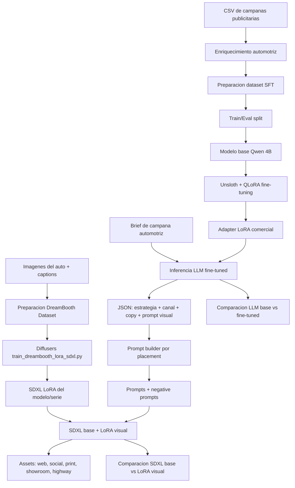

# Plan Demo Notebook: Automotive Marketing Content LoRA Studio

## Summary

Crear una demo autocontenida en un notebook para Kaggle o Google Colab siguiendo la estructura del notebook de referencia `LoRA_Logo_Marca_Colab.ipynb`, pero aplicada a generacion de contenido multimodal para campanas automotrices.

El approach del primer plan se mantiene: el eje visual sigue siendo entrenar un DreamBooth LoRA sobre SDXL/Diffusers para aprender la identidad de un auto o serie de autos y generar assets publicitarios por placement.

Para cubrir tambien el fine-tuning del LLM del plan anterior, la demo se enriquece con una segunda capa:

- fine-tuning de un LLM instructivo con Unsloth + LoRA/QLoRA para generar estrategia, copy, KPIs y prompts visuales desde briefs comerciales
- fine-tuning visual sobre un modelo de difusion con DreamBooth LoRA
- dataset comercial tabular/instructivo con minimo 200 ejemplos para el LLM
- dataset visual con imagenes del auto + descripciones/captions para el LoRA de difusion
- el objetivo es generar piezas visuales de marketing para distintos canales y placements
- la comparacion se hace en dos niveles: LLM base vs LLM fine-tuned, y SDXL base vs SDXL con LoRA visual

El proyecto sera una prueba funcional, no una app completa. La experiencia principal sera ejecutar el notebook de arriba hacia abajo y terminar con:

- dataset comercial preparado como ejemplos SFT
- LLM fine-tuned con LoRA/QLoRA usando Unsloth
- dataset visual preparado con imagenes y captions
- LoRA visual entrenado sobre SDXL/Diffusers
- comparacion base vs fine-tuned para texto y para imagen
- estrategia publicitaria, copy, KPIs y prompts comerciales para diferentes placements
- banners y piezas visuales generadas para una campana automotriz
- metricas simples y ejemplos para la presentacion final

## Contradictions Detected

- El plan nuevo decia explicitamente que el LLM no se fine-tunea y que solo se usa de forma opcional para prompt engineering. El plan viejo exige fine-tuning de LLM con Unsloth + LoRA/QLoRA. Esta version resuelve la contradiccion haciendo obligatorio el modulo LLM fine-tuned y manteniendo el DreamBooth LoRA visual como nucleo del approach original.
- El plan viejo usaba Diffusers solo para inferencia de imagenes, mientras el plan nuevo entrena un LoRA visual con Diffusers. No es una contradiccion tecnica: se puede conservar el entrenamiento visual como mejora diferenciadora y usar el LLM fine-tuned para producir los prompts que alimentan ese pipeline visual.

## Demo Concept

- Nombre sugerido: `Automotive Marketing Content LoRA Studio`.
- Industria: marketing automotriz, agencias creativas y equipos comerciales de concesionarios.
- Problema: producir piezas visuales consistentes para lanzamientos de autos requiere sesiones de diseno, adaptaciones por canal y revision de identidad visual.
- Solucion demo: un notebook que fine-tunea un LLM para proponer campanas automotrices y aprende el look de un auto/modelo desde imagenes con captions para generar visuales publicitarios consistentes.
- Usuario final: equipo de marketing automotriz, agencia creativa, planner de medios o concesionario.
- Ejemplo de campana: lanzamiento de un modelo real de auto. La marca/modelo exacto se definira cuando esten listas las imagenes y descripciones.

## Notebook Scope

El entregable principal sera un notebook:

```text
notebooks/proyecto_final_automotive_lora_marketing_colab_kaggle.ipynb
```

El notebook debe incluir secciones claramente ejecutables:

1. Verificar GPU.
2. Instalar librerias compatibles.
3. Configurar proyecto, marca/modelo y rutas.
4. Cargar dataset comercial tabular.
5. Enriquecer dataset con variables automotrices.
6. Preparar ejemplos SFT para el LLM.
7. Cargar modelo base con Unsloth.
8. Configurar LoRA/QLoRA.
9. Entrenar LLM comercial.
10. Comparar LLM base vs LLM fine-tuned.
11. Cargar imagenes + descriptions/captions.
12. Preparar dataset DreamBooth LoRA.
13. Descargar script oficial de entrenamiento Diffusers.
14. Configurar parametros de entrenamiento visual.
15. Entrenar LoRA visual.
16. Verificar adaptadores generados.
17. Cargar SDXL base con el LoRA visual entrenado.
18. Generar estrategia, copy y prompts de campana por placement con el LLM fine-tuned.
19. Generar piezas para web, social, showroom, print y highway banner.
20. Comparar SDXL base vs SDXL con LoRA visual.
21. Guardar galeria, metadata, metricas y conclusiones de negocio.

## Technical Requirements Coverage

- Python como lenguaje principal.
- Hugging Face Transformers para carga e inferencia del LLM.
- Unsloth para fine-tuning eficiente del LLM.
- LoRA/QLoRA para entrenar el LLM en recursos limitados.
- Modelo LLM de 4B a 13B parametros.
- Dataset comercial con minimo 200 ejemplos instructivos.
- Hugging Face Diffusers para entrenamiento e inferencia de imagenes.
- PEFT/LoRA para fine-tuning eficiente del modelo de difusion.
- DreamBooth LoRA para aprender un concepto visual especifico: el modelo/serie del auto.
- Dataset visual con imagenes + captions descriptivos.
- Comparacion LLM base vs LLM fine-tuned con metricas y ejemplos.
- Comparacion SDXL base vs SDXL con LoRA visual con ejemplos visuales.
- Notebook reproducible en Kaggle o Colab.
- README breve con instrucciones de ejecucion.
- Diagrama de arquitectura en Markdown/Mermaid.
- Estimacion de valor de negocio o ROI para la presentacion.

> Nota de alcance: esta version mantiene el fine-tuning visual con Diffusers porque el caso de uso final es generar contenido visual de marketing, pero agrega el fine-tuning de LLM con Unsloth para cumplir el requisito de generar estrategia comercial, copy y prompts visuales desde briefs.

## Commercial SFT Dataset Plan

Usar un dataset tabular de campanas publicitarias automotrices. Si no existe un dataset real de concesionaria, construir uno sintetico y reproducible a partir de `Social_Media_Advertising.csv`, enriqueciendo cada fila con variables del dominio vehicular.

Campos relevantes del dataset base:

- `Campaign_Goal`
- `Target_Audience`
- `Channel_Used`
- `Customer_Segment`
- `Location`
- `Language`
- `Duration`
- `Conversion_Rate`
- `Acquisition_Cost`
- `ROI`
- `Clicks`
- `Impressions`
- `Engagement_Score`
- `Company`

Campos automotrices a agregar:

- `Vehicle_Type`: sedan, SUV, pickup, hatchback, van, electric, hybrid, luxury, used
- `Vehicle_Model`: nombre comercial sintetico o realista
- `Price_Range`: economy, mid-range, premium, luxury
- `Customer_Sector`: familias, jovenes profesionales, emprendedores, empresas/flotas, conductores urbanos, clientes rurales, compradores eco-conscious
- `Purchase_Intent`: primer auto, renovacion, trabajo, familia, aventura, flota, ahorro combustible
- `Promotion_Type`: test drive, bono de descuento, financiamiento, mantenimiento incluido, entrega inmediata, retoma
- `Sales_Funnel_Stage`: awareness, consideration, lead generation, conversion, retention

Preparacion:

- limpiar costo de adquisicion removiendo `$` y convirtiendo a numero
- normalizar textos vacios
- tomar una muestra deterministica de 300 filas
- enriquecer cada fila con variables automotrices usando reglas deterministicas
- split sugerido: 240 ejemplos train y 60 ejemplos eval
- convertir cada fila a formato instructivo para campanas de concesionaria

Formato de ejemplo:

```json
{
  "instruction": "Act as an advertising strategist for an automotive dealership. Generate a campaign proposal in JSON.",
  "input": "Goal: Lead Generation | Vehicle: hybrid SUV | Price range: mid-range | Audience: Families 35-44 | Customer sector: urban families | Historical channel: Instagram | City: Miami | Language: English | Duration: 30 Days | Promotion: test drive + financing | ROI: 2.10 | Conversion rate: 0.08 | Engagement: 9",
  "output": {
    "strategy": "Promote safety, family space, and fuel efficiency, closing with a clear invitation to book a test drive.",
    "channel_plan": "Use Instagram for visual awareness and lead generation forms; reinforce with Meta Ads remarketing for interested prospects.",
    "ad_copy": "Give your family more space, technology, and efficiency. Book your test drive today and discover the hybrid SUV built for city life.",
    "image_prompt": "REALCARMODEL real car model in an English Instagram ad for a mid-range hybrid SUV dealership campaign targeting urban families in Miami, bright city background, premium automotive commercial photography, clear space for headline, no readable text",
    "kpis": ["Leads", "Cost per Lead", "Test Drive Bookings", "Conversion Rate", "ROI"],
    "business_note": "Prioritize qualified leads and measure test drive bookings before scaling the media budget."
  }
}
```

Campos obligatorios de salida del LLM:

- `strategy`
- `channel_plan`
- `ad_copy`
- `image_prompt`
- `kpis`
- `business_note`

Nota: `negative_prompt` no es obligatorio en el dataset SFT del LLM. El notebook debe generarlo en el prompt builder visual con un fallback deterministico; si aparece como campo extra en algun ejemplo, se puede aprovechar, pero no debe bloquear la validacion.

## Visual Dataset Plan

Usar una carpeta de imagenes del auto o serie de autos y captions asociados.

Estructura recomendada:

```text
data/car_campaign_lora/
  images/
    real_car_model_01.png
    real_car_model_02.png
    ...
  metadata.csv
  metadata_template.csv
```

El metadata debe tener una fila por imagen:

```csv
file_path,caption
./images/real_car_model_01.png,"REALCARMODEL real car model, front three quarter view, metallic blue paint, studio automotive photography, premium lighting"
```

Decision de dataset:

- `metadata.csv` sera la fuente de verdad para captions.
- No se usaran archivos `.txt` sidecar por imagen en esta demo.
- La razon es que el CSV facilita auditoria, edicion en lote, validacion de rutas y versionamiento cuando trabajemos con modelos reales.
- Esta estructura tambien deja listo el dataset para futuros scripts caption-aware si se decide entrenar con captions por imagen.

Nota tecnica: el script `train_dreambooth_lora_sdxl.py` usado en esta demo recibe un `instance_prompt` comun. Por eso las captions del metadata se usan para QA del dataset, documentacion, trazabilidad y construccion de prompts; no reemplazan automaticamente el `instance_prompt` en el comando base.

Cada caption debe estar en ingles y contener:

- trigger word unico del concepto visual
- marca/modelo o serie del auto
- angulo o vista del vehiculo
- color/materiales
- contexto visual
- tipo de fotografia

Ejemplos de captions:

```text
REALCARMODEL real car model, front three quarter view, metallic blue paint, studio automotive photography, premium lighting
REALCARMODEL real car model, side profile, urban night background, cinematic reflections, commercial car advertisement
REALCARMODEL real car model interior dashboard, modern digital cockpit, luxury materials, clean product photography
```

Recomendaciones:

- minimo tecnico: 8-15 imagenes para prueba rapida
- recomendado para demo final: 20-40 imagenes
- resolucion minima: 512x512
- mejor si las imagenes cubren frontal, lateral, trasera, interior, detalle de ruedas y contexto lifestyle
- evitar logos de terceros, texto pequeno y fondos demasiado caoticos

## Model And Training Plan

### LLM Fine-Tuning

Modelo recomendado:

- `unsloth/Qwen3-4B-Instruct-2507-unsloth-bnb-4bit`

Fallback si hay problemas de memoria o compatibilidad:

- `unsloth/Qwen2.5-3B-Instruct` solo para pruebas tecnicas, dejando documentado que el objetivo evaluable es usar un modelo de 4B-13B.

Configuracion inicial:

- `max_seq_length = 2048`
- `load_in_4bit = True`
- `r = 16`
- `lora_alpha = 16`
- `lora_dropout = 0`
- `bias = "none"`
- `use_gradient_checkpointing = "unsloth"`
- `learning_rate = 2e-4`
- `per_device_train_batch_size = 2`
- `gradient_accumulation_steps = 4`
- `num_train_epochs = 2` para demo rapida
- `num_train_epochs = 3` para resultado final si el tiempo lo permite
- `optim = "adamw_8bit"`
- `seed = 3407`

Output:

```text
outputs/commercial-qwen-lora/
```

### Visual LoRA Fine-Tuning

Modelo recomendado para fine-tuning visual:

- `stabilityai/stable-diffusion-xl-base-1.0`

Script de entrenamiento:

- `train_dreambooth_lora_sdxl.py` desde Hugging Face Diffusers

Configuracion inicial estilo notebook de referencia:

- `resolution = 512`
- `train_batch_size = 1`
- `gradient_accumulation_steps = 4`
- `learning_rate = 1e-4`
- `lr_scheduler = "constant"`
- `max_train_steps = 250` para demo rapida en Colab/Kaggle free tier
- `max_train_steps = 400-800` para resultado final si la GPU y el tiempo lo permiten
- `rank = 16`
- `mixed_precision = "fp16"`
- `seed = 3407`
- `instance_prompt = "REALCARMODEL real car model automotive marketing campaign asset"`

Outputs:

```text
outputs/commercial-qwen-lora/
outputs/automotive-lora/
outputs/generated_assets/
outputs/evaluation/
```

## Prompt Engineering Plan

El prompt base se construye desde un brief de campana y desde la salida JSON del LLM fine-tuned. El LLM debe convertir datos comerciales en estrategia, copy, plan de canal e `image_prompt`; luego el notebook ajusta el prompt visual por placement y dimensiones, y agrega un `negative_prompt` deterministico para Diffusers.

Brief de ejemplo:

```python
campaign_brief = {
    "brand": "Ford",
    "model_series": "TBD real model",
    "trigger_word": "REALCARMODEL",
    "campaign_goal": "Lead Generation",
    "vehicle_type": "SUV hibrida",
    "price_range": "mid-range",
    "launch_message": "new model launch campaign",
    "target_audience": "Families 35-44",
    "customer_sector": "familias urbanas",
    "market": "Miami, US and Latin America",
    "preferred_channels": ["Instagram", "Facebook"],
    "promotion_type": "test drive + financiamiento",
    "tone": "premium, confident, innovative",
}
```

Placements esperados:

- website hero banner, horizontal 16:9
- Instagram feed, square 1:1
- Instagram story or TikTok vertical, 9:16
- dealership showroom poster, vertical print
- highway billboard, ultra-wide
- email header, wide horizontal
- product detail image, clean studio

Prompt ejemplo:

```text
REALCARMODEL real car model in a premium website hero banner, new model launch campaign, professionals 30-45, cinematic automotive photography, clean reflections, modern city skyline, confident innovative tone, no readable text, high quality commercial advertising
```

Negative prompt sugerido:

```text
blurry, low quality, watermark, distorted text, malformed logo, extra wheels, deformed car, broken headlights, bad perspective, jpeg artifacts, people with distorted faces
```

## Fine-Tuned LLM Campaign Generator

El LLM se fine-tunea y su rol es generar la capa comercial que alimenta la generacion visual:

- transformar un brief comercial en una propuesta de campana en JSON
- recomendar canal segun target, etapa de funnel, historico y promocion
- redactar copy publicitario usable por una concesionaria
- proponer KPIs y una nota de negocio
- transformar un brief comercial en prompts especificos por placement
- enriquecer estilo, composicion, iluminacion y angulo de camara
- generar negative prompts mas robustos
- mantener consistencia de trigger word y restricciones de marca

Implementacion sugerida:

- una celda `TRAIN_LLM = True` por defecto para el flujo final evaluable
- una celda `USE_FINE_TUNED_LLM = True` para usar el adapter entrenado en la demo end-to-end
- guardar adapter en `outputs/commercial-qwen-lora/`
- usar el mismo brief para inferencia con modelo base y modelo fine-tuned
- fallback deterministico: usar plantillas Python de prompts solo si no hay GPU o si falla la carga del LLM, dejando documentada la limitacion

## Evaluation Plan

Comparacion LLM base vs LLM fine-tuned:

- usar 5 briefs del set de evaluacion
- generar respuesta con modelo base
- generar respuesta con modelo fine-tuned
- mostrar tabla con ambos resultados
- evaluar si la salida cumple el esquema JSON esperado

Metricas cuantitativas del LLM:

- training loss final
- eval loss si el trainer la produce
- porcentaje de respuestas con JSON valido
- cobertura de campos obligatorios: `strategy`, `channel_plan`, `ad_copy`, `image_prompt`, `kpis`, `business_note`
- similitud Jaccard simple entre salida generada y salida esperada
- latencia promedio de inferencia

Evaluacion cualitativa del LLM:

- tono comercial
- claridad de recomendacion
- uso de metricas historicas
- calidad del copy
- utilidad del prompt visual
- alineacion con target, canal y etapa del funnel

Comparacion SDXL base vs SDXL con LoRA visual:

- usar 3-5 prompts identicos
- generar imagen con SDXL base sin LoRA
- cargar LoRA visual y generar la misma pieza con igual seed
- mostrar comparacion lado a lado

Metricas cuantitativas visuales:

- training loss final si el script la reporta
- numero de imagenes de entrenamiento
- numero de captions validos
- numero de assets generados
- tiempo promedio de generacion por asset
- cobertura de placements requeridos

Evaluacion cualitativa visual:

- identidad visual del auto reconocible
- consistencia entre vistas del vehiculo
- calidad publicitaria
- alineacion con placement
- claridad de composicion
- ausencia de texto deformado, marcas de agua o anatomia vehicular extraña

## End-To-End Demo Flow

El notebook debe cerrar con una celda de demo que reciba un brief nuevo:

```python
campaign_brief = {
    "brand": "Ford",
    "model_series": "TBD real model",
    "trigger_word": "REALCARMODEL",
    "campaign_goal": "Lead Generation",
    "vehicle_type": "SUV hibrida",
    "vehicle_model": "Nova Hybrid X",
    "price_range": "mid-range",
    "launch_message": "new model launch campaign",
    "target_audience": "Families 35-44",
    "customer_sector": "familias urbanas",
    "location": "Miami",
    "language": "Spanish",
    "duration": "30 Days",
    "preferred_channels": ["Instagram", "Facebook"],
    "promotion_type": "test drive + financiamiento",
    "budget_hint": "$1,500",
    "market": "US and Latin America",
    "tone": "premium, confident, innovative",
}
```

La demo debe producir:

1. propuesta comercial en JSON generada por el LLM fine-tuned
2. copy publicitario
3. recomendacion de canal segun target y etapa del funnel
4. KPIs recomendados
5. prompts de campana por placement
6. negative prompt recomendado
7. imagenes generadas para al menos 5 placements
8. comparacion LLM base vs LLM fine-tuned
9. comparacion SDXL base vs SDXL con LoRA visual
10. tabla con prompt, seed, modelo, dimensiones y observacion cualitativa
11. breve interpretacion de valor de negocio

## Minimal File Set

Para mantenerlo como demo notebook, el proyecto necesita:

```text
notebooks/proyecto_final_automotive_lora_marketing_colab_kaggle.ipynb
data/Social_Media_Advertising.csv
data/commercial_campaign_sft/
data/car_campaign_lora/images/
README_demo.md
docs/demo_architecture.md
scripts/build_commercial_sft_dataset.py
scripts/build_demo_assets.py
```

Archivos opcionales:

```text
outputs/commercial-qwen-lora/
outputs/automotive-lora/
outputs/generated_assets/
outputs/evaluation/llm_evaluation_report.json
outputs/evaluation/image_generation_metadata.json
```

## README Demo Content

`README_demo.md` debe explicar:

- objetivo del proyecto
- requerimientos de GPU
- como correr en Colab
- como correr en Kaggle
- donde subir/cargar el CSV comercial
- como preparar el dataset SFT
- como entrenar el LoRA/QLoRA del LLM
- donde subir/cargar imagenes y captions
- como entrenar el LoRA visual
- como generar assets de marketing
- que outputs se esperan
- limitaciones conocidas

## Architecture Diagram

Incluir en `docs/demo_architecture.md` o dentro del notebook:



## Business Value / ROI Narrative

Hipotesis de impacto para la presentacion:

- reducir produccion inicial de concepts visuales de dias a minutos
- reducir preparacion de propuestas comerciales de horas a minutos
- generar variantes por placement antes de una sesion de diseno final
- mejorar consistencia visual de la campana para el mismo modelo de auto
- mejorar consistencia entre oferta comercial, copy, target, canal e imagen
- acelerar aprobaciones internas con mockups tangibles
- acelerar pruebas A/B por canal: Meta, TikTok, YouTube, Google Display o email
- producir primeras propuestas para concesionarios, agencias y equipos comerciales

Formula simple de ROI:

```text
ROI estimado = ((horas creativas ahorradas * costo hora equipo creativo * campanas mensuales) + (horas comerciales ahorradas * costo hora comercial * propuestas mensuales) - costo operativo IA) / costo operativo IA
```

Ejemplo para presentacion:

```text
Si se ahorran 12 horas creativas por campana, con 6 campanas al mes y un costo de USD 35/hora:
ahorro creativo mensual = 12 * 6 * 35 = USD 2,520
Si ademas se ahorran 2 horas comerciales por propuesta, con 40 propuestas al mes y un costo de USD 25/hora:
ahorro comercial mensual = 2 * 40 * 25 = USD 2,000
si el costo operativo mensual de IA es USD 300:
ROI = (2,520 + 2,000 - 300) / 300 = 14.07x
```

## Acceptance Criteria

- El notebook puede ejecutarse secuencialmente en Kaggle o Colab con GPU.
- El dataset comercial procesado contiene minimo 200 ejemplos.
- El entrenamiento del LLM usa Unsloth + LoRA/QLoRA.
- El modelo LLM base esta en el rango 4B-13B o se documenta un fallback tecnico.
- Se guardan adaptadores LoRA del LLM.
- Hay comparacion LLM base vs LLM fine-tuned.
- Se generan metricas cuantitativas basicas para el LLM.
- El dataset visual contiene imagenes y captions validos.
- El entrenamiento usa Diffusers + DreamBooth LoRA.
- Se guardan adaptadores LoRA visuales.
- Hay comparacion SDXL base vs SDXL con LoRA visual.
- Se generan assets para multiples placements de marketing automotriz.
- Se genera metadata de prompts, seeds, dimensiones y paths.
- Hay diagrama de arquitectura.
- Hay narrativa clara de impacto comercial/ROI.

## Assumptions

- El alcance es una demo academica reproducible, no una app productiva.
- Kaggle/Colab tendran GPU disponible para entrenamiento.
- El dataset visual sera aportado por el equipo, con derechos de uso.
- El dataset comercial tabular sera convertido a ejemplos instructivos sinteticos de publicidad automotriz.
- Las marcas/modelos de vehiculos pueden ser sinteticos para evitar dependencia de datos privados de una concesionaria real.
- Si la GPU disponible no alcanza para entrenar ambos modelos en la misma sesion, el notebook debe permitir ejecutar primero el LLM y luego el LoRA visual, guardando outputs intermedios.
- La presentacion se construira despues usando resultados, comparaciones y screenshots del notebook.
