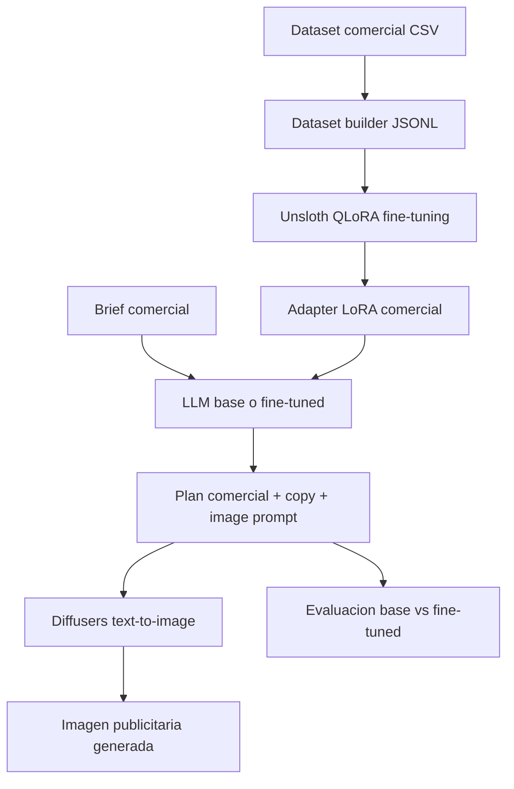

# Plan De Codigo: Commercial Creative Intelligence Pipeline

## Summary

Crear un proyecto independiente para una solucion generativa multimodal orientada al area comercial/marketing. El producto ayudara a un equipo comercial a convertir datos de campanas y un brief de negocio en una recomendacion accionable, copy publicitario y una pieza visual generada automaticamente.

El flujo principal sera: dataset comercial -> fine-tuning de LLM con Unsloth + LoRA -> generacion de estrategia/copy/prompt visual -> generacion de imagen con Diffusers -> comparacion base vs fine-tuned -> reporte tecnico y demo.

Este plan no depende del chatbot RAG existente de la repo. Puede vivir como proyecto aparte dentro de una carpeta nueva, por ejemplo `commercial_genai_project/`, o como repo independiente.

## Project Concept

- Nombre sugerido: `Commercial Creative Intelligence Pipeline`.
- Industria: marketing digital, publicidad y equipos comerciales.
- Problema: los equipos comerciales necesitan producir propuestas de campana, mensajes y visuales rapidamente, pero suelen depender de analisis manual, copywriting repetitivo y ciclos lentos de diseno.
- Solucion: un pipeline que aprende patrones comerciales desde un dataset de campanas y genera recomendaciones especializadas para nuevos briefs.
- Usuario objetivo: ejecutivo comercial, planner de marketing, growth manager o agencia digital.

## Required Technical Scope

- Lenguaje principal: Python.
- Modelo LLM base de Hugging Face entre 4B y 13B parametros.
- Fine-tuning eficiente con Unsloth + LoRA o QLoRA.
- Dataset minimo de 200 ejemplos relevantes al caso comercial.
- Generacion de imagenes con Diffusers usando Stable Diffusion, SDXL Turbo, SDXL base o FLUX si el entorno lo permite.
- Notebook reproducible en Google Colab o Jupyter.
- Comparacion cuantitativa y cualitativa entre modelo base y modelo fine-tuned.
- README con instalacion, ejecucion y estructura del proyecto.
- Diagrama de arquitectura.
- Outputs finales listos para apoyar una presentacion ejecutiva con impacto/ROI.

## Proposed Structure

```text
commercial_genai_project/
  app/
    streamlit_app.py
  data/
    raw/
      Social_Media_Advertising.csv
    processed/
      commercial_sft_train.jsonl
      commercial_sft_eval.jsonl
      evaluation_report.json
    generated_assets/
  notebooks/
    proyecto_final_commercial_pipeline.ipynb
  scripts/
    prepare_dataset.py
    train_lora.py
    evaluate_model.py
    generate_assets.py
  src/
    commercial_ai/
      __init__.py
      schemas.py
      dataset_builder.py
      prompt_templates.py
      llm_inference.py
      image_generation.py
      evaluation.py
      pipeline.py
  docs/
    architecture.md
    data_dictionary.md
    experiments.md
  requirements.txt
  requirements-colab.txt
  README.md
```

## Dataset Plan

- Usar como base un dataset tabular comercial de campanas, idealmente el CSV de social media advertising disponible en esta repo.
- Cada fila se transformara en un ejemplo instructivo con:
  - objetivo de campana
  - audiencia
  - canal
  - segmento
  - ubicacion
  - idioma
  - duracion
  - metricas: ROI, conversion rate, clicks, impressions, engagement score, acquisition cost
- Generar al menos 300 ejemplos para tener margen sobre el minimo de 200.
- Dividir de forma deterministica:
  - `240` ejemplos para entrenamiento
  - `60` ejemplos para evaluacion
- Formato recomendado JSONL:

```json
{
  "instruction": "Genera una recomendacion comercial para una campana digital y devuelve un JSON estructurado.",
  "input": "Objetivo: Product Launch | Audiencia: Men 45-60 | Canal: Instagram | Segmento: Technology | Ciudad: Austin | Idioma: Spanish | Duracion: 15 Days | ROI historico: 0.43 | Conversion rate: 0.08",
  "output": {
    "commercial_strategy": "...",
    "channel_recommendation": "...",
    "ad_copy": "...",
    "image_prompt": "...",
    "recommended_kpis": ["ROI", "Conversion Rate", "CTR"],
    "risk_notes": "..."
  }
}
```

## LLM Fine-Tuning Plan

- Modelo recomendado: `unsloth/Qwen3-4B-Instruct-2507-unsloth-bnb-4bit`.
- Alternativa si hay incompatibilidades: `unsloth/Qwen2.5-3B-Instruct` como fallback didactico, aunque el objetivo principal debe mantenerse en el rango 4B-13B.
- Tecnica: QLoRA con carga 4-bit.
- Configuracion inicial:
  - `max_seq_length = 2048`
  - `r = 16`
  - `lora_alpha = 16`
  - `lora_dropout = 0`
  - `target_modules = ["q_proj", "k_proj", "v_proj", "o_proj", "gate_proj", "up_proj", "down_proj"]`
  - `learning_rate = 2e-4`
  - `per_device_train_batch_size = 2`
  - `gradient_accumulation_steps = 4`
  - `num_train_epochs = 3`
  - `seed = 3407`
- Guardar:
  - adaptadores LoRA en `models/commercial-qwen-lora/`
  - opcionalmente modelo mergeado si el entorno tiene espacio suficiente

## Image Generation Plan

- Usar Diffusers para generar imagenes a partir del `image_prompt` producido por el LLM fine-tuned.
- Modelo default para demo rapida: `stabilityai/sdxl-turbo`.
- Modelo opcional para mejor calidad: `stabilityai/stable-diffusion-xl-base-1.0`.
- Entradas:
  - prompt generado por el LLM
  - negative prompt fijo para evitar baja calidad, marcas de agua, texto deformado y artefactos
  - seed reproducible
  - guidance/steps configurables
- Salidas:
  - imagen PNG en `data/generated_assets/`
  - metadata JSON con prompt, seed, modelo, fecha y brief usado
- No se entrenara un LoRA visual; la parte visual sera inferencia text-to-image, suficiente para cumplir el requisito de Diffusers.

## Evaluation Plan

- Comparacion cualitativa:
  - seleccionar 5 briefs comerciales nuevos
  - generar respuestas con modelo base
  - generar respuestas con modelo fine-tuned
  - documentar diferencias en estructura, tono comercial, uso de metricas y utilidad para negocio
- Comparacion cuantitativa:
  - eval loss del entrenamiento
  - tasa de outputs JSON validos
  - cobertura de campos obligatorios
  - similitud Jaccard o ROUGE simple contra referencia
  - latencia promedio de inferencia
- Evaluacion visual:
  - generar al menos 3 imagenes para briefs distintos
  - registrar prompt, seed y modelo
  - evaluar manualmente: alineacion con brief, calidad visual, utilidad comercial y limitaciones

## Demo Plan

- Notebook principal:
  - instala dependencias
  - prepara dataset
  - entrena LoRA
  - compara base vs fine-tuned
  - genera prompts visuales
  - genera imagenes con Diffusers
  - muestra resultados finales en tablas y galeria
- App Streamlit opcional:
  - formulario de brief comercial
  - boton `Generate commercial plan`
  - vista estructurada del JSON generado
  - boton `Generate image`
  - galeria de imagenes generadas
- La demo debe poder ejecutarse aunque no se entrene de nuevo, cargando un adapter LoRA previamente guardado.

## README And Documentation

- README debe incluir:
  - problema comercial
  - arquitectura
  - instalacion local
  - ejecucion en Colab
  - comandos de scripts
  - como regenerar dataset
  - como entrenar
  - como evaluar
  - como generar imagenes
- `docs/architecture.md` debe incluir un diagrama Mermaid:



## Implementation Milestones

1. Crear estructura standalone del proyecto y requirements.
2. Implementar `schemas.py` con modelos de brief, output comercial y asset visual.
3. Implementar `dataset_builder.py` y `scripts/prepare_dataset.py`.
4. Crear notebook con secciones de instalacion, dataset y entrenamiento.
5. Implementar entrenamiento LoRA siguiendo el patron del taller de Qwen/Unsloth.
6. Implementar inferencia base vs fine-tuned.
7. Implementar generacion de imagenes con Diffusers siguiendo el patron del taller visual.
8. Implementar evaluacion y reporte.
9. Crear app Streamlit opcional.
10. Completar README, arquitectura y documentacion de experimentos.

## Acceptance Criteria

- Existe un dataset procesado con minimo 200 ejemplos comerciales.
- El notebook corre secuencialmente en Colab con GPU.
- El entrenamiento usa Transformers, Unsloth y LoRA/QLoRA sobre un modelo 4B-13B.
- El proyecto genera al menos una comparacion base vs fine-tuned.
- El proyecto genera al menos una imagen usando Diffusers.
- Los outputs incluyen recomendacion comercial, copy publicitario, prompt visual y KPIs.
- Hay README, diagrama de arquitectura y reporte de evaluacion.
- La demo permite explicar valor de negocio e impacto potencial.

## Business Impact / ROI Narrative

- Reducir tiempo de preparacion de propuestas comerciales de horas a minutos.
- Acelerar iteracion de conceptos creativos antes de involucrar diseno.
- Estandarizar recomendaciones usando historico de campanas y metricas comerciales.
- Mejorar consistencia del copy y de los entregables para clientes.
- ROI estimado para presentacion: ahorro de horas por propuesta + mayor velocidad de respuesta comercial + posibilidad de producir mas variantes por campana.

## Assumptions

- El foco sera marketing digital/comercial, no atencion al cliente ni RAG.
- El dataset comercial inicial sera suficiente para construir ejemplos instructivos relevantes.
- El entrenamiento se realizara en Colab con GPU.
- La generacion de imagenes sera por inferencia con Diffusers, sin entrenamiento visual.
- La app Streamlit es deseable para demo, pero el entregable critico sera el notebook reproducible.
